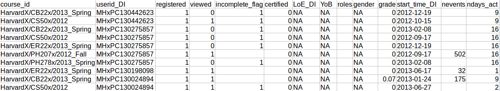
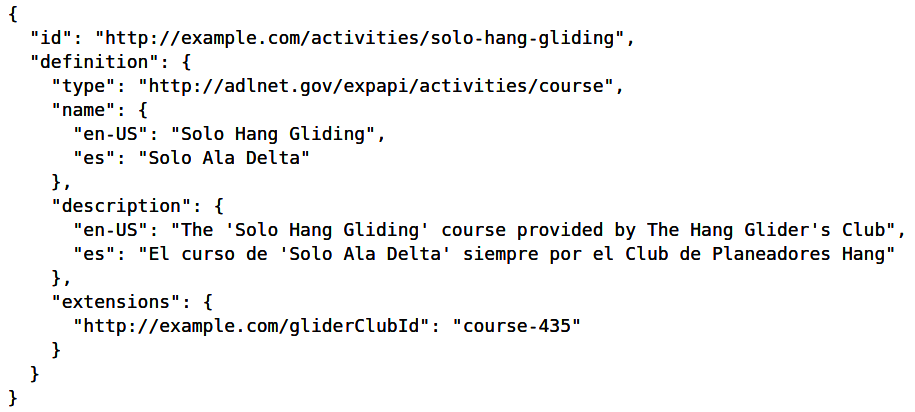
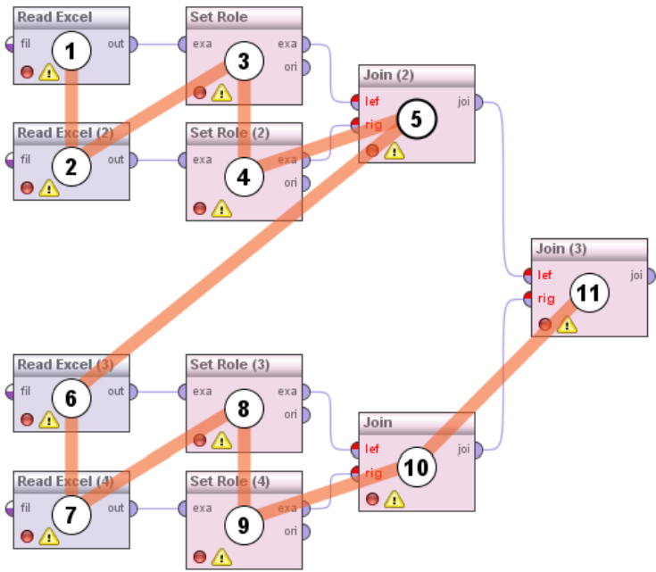

# DM sourcée par les traces

## Introduction

Une autre approche qui a émergé ces dernières années dans l'aide à la décision est le traitement automatisé des données produites par les utilisateurs pour identifier des comportements, des modèles et des connaissances. C'est une fois analysées que ces données prennent tout leur sens et peuvent entrer dans des systèmes de recommendation, d'explication, de navigation... L'on utilise souvent des représentation visuelle et/ou quantifier pour les représenter - qu'on appelle **indicateur**.

Dans cette section, nous allons regarder cela du point de vue du domaine des Environnement Informatique pour l'Apprentissage Humain \(EIAH\) et des Learning Analytics.

## Traces

Dans les systèmes informatiques il est courant d'observer des mécanismes de log pour récupérer l'état du système actuel, et avoir des informations en vue de debuggage.

Lorsque ces logs n'ont plus simplement vocation a être utilisé pour debugger un système, mais pour essayer de comprendre ce qu'il se passe au sein de l'activité, on parle alors de **traces**. Dans le cas des EIAH, on parle de traces d'apprentissage, que les étudiants génèrent lorsqu'ils réalisent une activité pédagogique.

Dans l'extrait ci-avant, on observe par exemple que les données tracées sont riches et diversifiées, permettant possiblement d'extraire des informations pertinentes sur l'activité pédagogique.

La particularité d'une trace, c'est que **son modèle a été réfléchi en amont**. Ceci en vue d'englober toutes les informations nécessaires qui pourraient être produites par l'association de ce que l'on souhaite observer de l'activité \(ici, pédagogique\) et la capacité de l'outil à tracer ces actions.

Aussi, on voit apparaître des modèles génériques, standardisés et semantisés de traces, comme xAPI en EIAH, pour modéliser ces traces produites.

L'avantage est d'homogénéiser l'expressivité de ce qui est tracé, et de pouvoir le stocker dans des bases communes.


En soit, des données ne servent à rien tant qu'elles n'ont pas été **analysées et interprétées**. Cependant, si la qualité de vos données est médiocre \(_i.e._ modèle inconsistant, senseur peut fiable...\), alors vos résultats post-analyse le seront aussi, et vous ne pourrez pas en tirer de conclusions correctes ; pouvant même potentiellement vous faire prendre des décisions basées sur des faits inconstants. Aussi, cette étape là est primordiale dans une approche de DM basée sur la data.


Aussi, il est primordial d'étudier convenablement son outil informatique à tracer, les objectifs du traçage et tous les autres éléments pertinents pour aboutir à un modèle précis et documenter de traces, pour pouvoir les analyser correctement.

## Indicateurs

Un indicateur est une métrique représentant la distance entre une observation conduite et un attendu, plus ou moins précis, et qui est une **connaissance activable pour un public défini**.

Autrement dit, sans besoin ni public identifiés au préalable, il n'est pas possible de proposer un indicateur pertinent.

### Processus d'analyse

Un indicateur est un artefact informatique complexe qui repose sur une analyse des traces produites préalablement, et l'interprétation de l'analyse réalisée - voire comment il se trouve décrit au public final.

Ces analyses peuvent être plus ou moins complexes, et se manifester sous différentes formes \(Excel, Python, R, RapidMiner, etc.\).

C'est une tâche complexe, qui nécessite de comprendre convenablement la situation analysée, les outils déployés et leur limites. L'objectif ici est de produire des connaissances activables.


Il n'existe pas de processus d'analyse tout fait qui peut être réutilisé en l'état. Par essence, un processus est dépendant des données sur lesquelles il a été bâti. Néanmoins, il est possible d'identifier les parties "à risque" pour pouvoir le réutiliser dans d'autres contextes.


### Visualisation

Bien communiquer les résultats d'une analyse est essentiel pour permettre aux utilisateurs de prendre une décision correcte. Cette communication, bien souvent, est relayée uniquement par une visualisation de la métrique et/ou la différence avec l'attendu. Or, elle est plus ou moins claire, et dépendante du contexte social-culturel-domaine dans lequel elle est utilisée et de l'information qu'on souhaite afficher.

![Nombre d&#x2019;apprenants par nombre de pas vus \[Vermeulen18\]](../.gitbook/assets/indic1.png)

La visualisation précédente est totalement inadaptée pour représenter graphiquement les chemins des étudiants dans une application. Dans une telle situation, on pourrait le représenter par un graphe orienté ; mais alors l'information serait volumineuse, et difficile à exploiter par un humain non coûtumier de ce genre de modélisation.

Un autre visualisation pourrait être la suivante :

![Visualisation des chemins des 9 &#xE9;tudiants ayant obtenu un game over. La s&#xE9;quence \[AB, AC, AU, AF\] est encadr&#xE9;e en noir. \[Vermeulen18\]](../.gitbook/assets/indic2.png)

Ce dendrogramme encode les étapes de l'activité par une couleur, et la succession indique l'enchaînement des étapes au sein de l'activité : dans cette visualisation on interprète que le temps de réalisation de la tâche n'avait pas d'importance pour la personne qui essaie de nous communiquer l'information.


Ce sont les indicateurs qui constituent les éléments principaux d'aide à la décision pour les utilisateurs. Ces derniers interprétent donc la sémantique des indicateurs et en tire des conclusions : il est toujours préférable de fournir une documentation avec. Par exemple, si votre indicateur s'établit dans un intervalle entre $$[-1;1]$$, que signifie $$-1$$, $$0$$ et $$1$$ ?


## Tableaux de bord \(_Dashboard_\)

> Un tableau de bord est une vue à la fois activable, synthétique et consolidée de connaissances activables \(_i.e._ données analysées et post-traitées : indicateurs\) afin de fournir les outils nécessaires à la compréhension d'une situation particulière et permettre une aide à la décision. \(Moi, 2021\)

Élaborer un tableau de bord est une tâche complexe. En plus de devoir correctement travailler la sémantique des indicateurs de manière individuelle, dans le cas du tableau de bord, il faut être capable de prendre du recule, et de s'assurer que la combinaison de plusieurs indicateurs reste compréhensible et ne perverti pas leur sémantique initiale.

![Tableau de bord LAPA \[Park et Jo, 2015\]](../.gitbook/assets/dashboard.png)

Les tableaux de bord sont utilisés dans de nombreuses disciplines \(_e.g._ aviation, économie\) et revêt un caractère important. Ils sont le dernier maillon de la chaîne de traitement des données.

