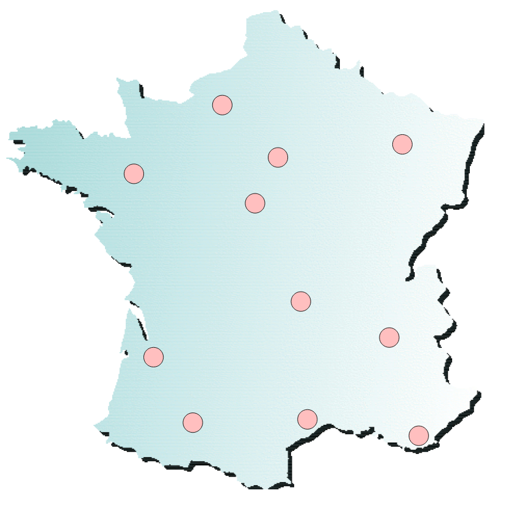
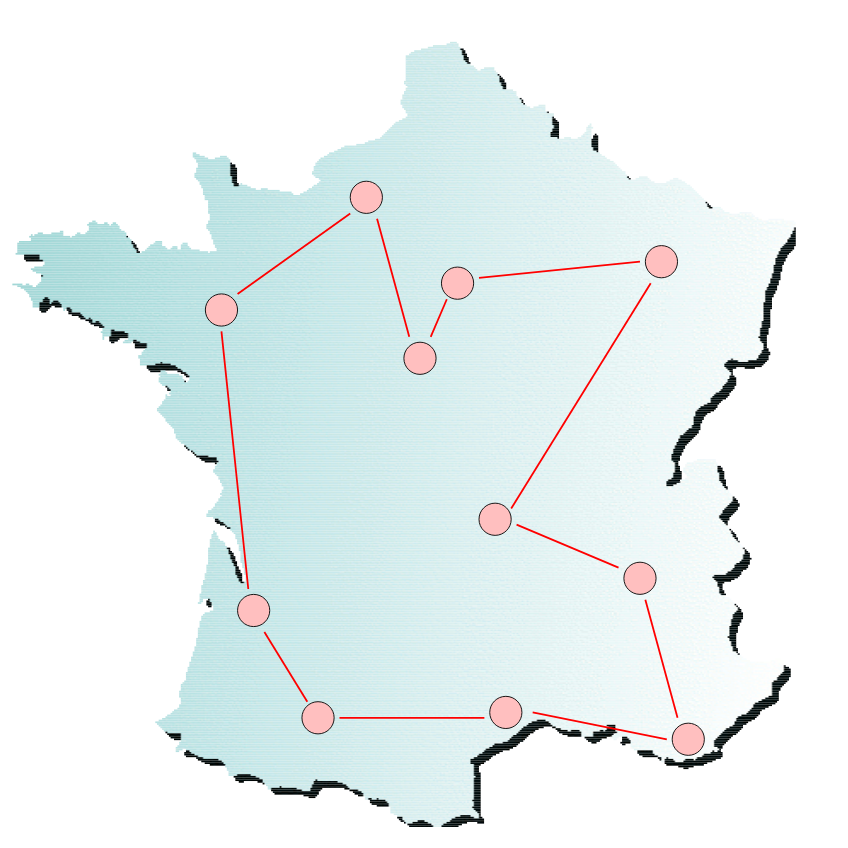
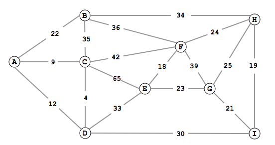
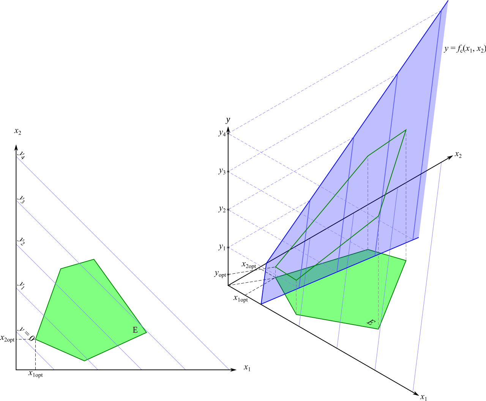
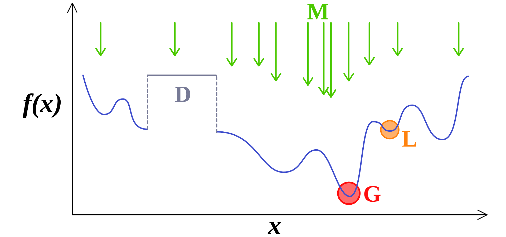

# Recherche Opérationnelle

## Introduction

La recherche opérationnelle (RO) est une discipline scientifique regroupant des méthodes afin d'identifier le ou les choix les plus pertinents à opérer afin d'obtenir le meilleur résultat possible, ou visé, dans une situation souvent complexe où l'Homme ne trouverait pas (facilement) de solution.

Elle repose sur un ensemble d'outils, bien souvent mathématique (*i.e.* graphe), qui permettent de répondre à des problèmes en lien avec l'informatique, les sciences financières, la production et la logistique, la planification, la simulation, les politiques sociétales...

La RO intervient dans la prise de décision automatique, mais aussi (et surtout) dans l'aide à la décision. Elle apporte notamment des outils pour :

* planifier
* optimiser
* explorer
* rationaliser

La pluralité de cette discipline et le vaste champ des problèmes quelles se proposent de traiter obligent ses praticiens de constamment étudier le problème et d'identifier les outils les plus appropriés pour fournir des solutions cohérentes et efficaces.


Il s'agit d'une introduction à la RO, et non pas une formation. *Operations Research: Applications and Algorithms (2004), par W. L. Winston* peut être un bon point d'entrée pour le curieux.


## Application

La RO est vaste, et s'interlace facilement avec d'autres disciplines pour renforcer la compréhension du problème et extraire des solutions pertinentes. On peut grossièrement catégoriser où intervient la RO.

### Intuition
Pour bien voir l'utilité de la RO, rien de mieux qu'un (classique) exemple du *Traveling Sales Man Problem* (voyageur de commerce).

Notre objectif, c'est, en partant d'une certaine ville $$v$$, de parcourir toutes les villes sur notre fiche de route en faisant **la tournée la plus courte**.

Pour résoudre se problème, autrement dit trouver une affectation des variables (*i.e.* l'ordre des villes) qui soit optimal, on va dresser une matrice de distance pour chacune des villes. Résultat :

([Source des images](https://pagesperso.g-scop.grenoble-inp.fr/~braunern/RO.pdf))

### Combinatoire
Un problème est dit combinatoire lorsque l'espace des assignements des variables qui le compose est grand, et où parmi ces assignements on cherche une solution soit optimale, soit proche de l'optimum. Autrement dit, il est nécessaire d'explorer une grande partie de l'espace pour s'assurer que la solution trouvée est (très) bonne, voire est la meilleure.

*Exemple : *
> On souhaite installer 7 machines dans un entrepôt ; ces machines sont standardisés en taille, et l'entrepôt a été préalablement découpé en 40 carrés de la taille d'une machine. Si on souhaite placer ces machines de tel sorte que le coût de manutention des objets entre ces machines soient minimal, il faut explorer les $$615237480$$ solutions possibles pour pouvoir dire : celle là est la meilleur.


Si ce point vous intéresse, contactez Jérémie Humeau à imt-lille-douai !


### Incertains
Tenter de trouver une solution proche de l'optimum ou optimal, alors qu'il se pose en terme incertains est également un domaine d'application de la RO. Bien souvent, quand on observe des phénomènes naturels, on y calque des lois probabilistes et de distributions statistique pour les modéliser.

*Exemple : *
> Maintenant que votre entrepôt a été converti en usine et que vous avez maximisez vos profits, vous ouvrez votre magasin pour vendre vos produits. Vous souhaitez limiter le temps d'attente de vos clients pour qu'il reparte satisfait (par exemple, qu'il ait moins de 5% de chance d'attendre plus de 10 minutes). Votre problème consiste à déterminer le nombre de caisses que vous devez ouvrir à un instant $$\tau$$, et pour cela, vous aurez besoin de connaître la distribution aléatoire du nombre des personnes qui rentre dans votre magasin, disons toute les minutes, et également la distribution aléatoire de la durée du traitement de la commande d'une personne.

### Concurrentiels
Bien souvent, un problème ne se résume pas à un seul acteur : les termes ne dépendent pas seulement des propres agissement d'un acteur, mais également d'autres décideurs. Aussi, déterminer un solution proche de l'optimum ou optimale dans ce type de situation où de fortes interrelation existent est difficile (*e.g.* le monde de la finance).

*Exemple : *
> Maintenant que vous avez pignons sur rue, vous allez devoir fixer le prix de vente de vos produits. Problème, ce prix va dépendre de vos concurrents, mais votre objectif est de maximiser vos gains. Quel sera le comportement des autres acteurs lorsque vous choisirez une ligne tarifaire, etc.

## Quelques outils

Dans cette section, nous allons brièvement évoquer certains "outils" qui interviennent fréquemment dans la RO. L'objectif est de vous donner des pointeurs vers ce type d'outils pour plus tard.

### Graphe
L'un des outils que j'ai le plus croisé dans la RO est, à mon sens, le graphe valué.

Il s'agit d'un graphe (un ensemble de noeuds et d'arêtes) où les arêtes possèdent un poids. Ce poids véhicule une sémantique particulière au problème, par exemple :

* Un coût
* Une distance
* Un prix

C'est un outil mathématique très pratique pour représenter les réseaux (pas que ceux d'internet !), l'ordonnancement, les planifications, etc.

### Optimisation linéaire

Avec ce type de modélisation, on cherche à minimiser une fonction, exprimée linéairement (ainsi que les contraintes que l'on applique dessus).

Plus généralement, cela nous permet

* minimiser/maximiser quelque chose (*e.g.* le coût, le profit) : $$min(c_1 x_1 + c_2 x_2 + \dots + c_n x_n$$ ;
* satisfaire des spécifications (*e.g.* un demande) : $$c_1 x_1 + c_2 x_2 + \dots + c_n x_n \geq a $$
* évoluer dans des environnements limités (*e.g.* matériau rare) : $$c_1 x_1 + c_2 x_2 + \dots + c_n x_n \leq a $$
* vérifier l'existence (*e.g.* qu'on a bien produit) : $$x_1, x_2, \dots , x_n > 0 $$

### MDP

Les Processus de Décision Markovien permettent de raisonner en situation incertaine.

Grossièrement, il s'agit d'un graphe probabiliste d'états où chaque arête représenté une la probabilité de réaliser une action, et apporte une récompense (négative ou positive) lorsqu'entreprise.


Si ce point vous intéresse, contactez Guillaume Lozenguez à imt-lille-douai !


### Heuristiques & métaheuristiques

Lorsque les problèmes sont tellement complexes qu'aucune solution ne peut être obtenu en temps raisonnable, on a recours à des approches par heuristiques ou métaheuristiques.


La notion de "temps raisonnable" dépend principalement du contexte ! Dans une problématique de temps réél, cela peut être quelques millisecondes, alors que pour des problèmes ne nécessitant pas du temps réél (*e.g.* création d'un modèle), quelques jours/semaines.


Une heuristique consiste à introduire de la connaissance experte lors de la résolution du problème pour "élaguer" l'espace des possibles et ainsi "aiguiller" la recherche vers des sous-espaces qui sont supposés (sans assurance) cohérent. Elle est généralement faite à la main.

Une approche par métaheuristique, c'est un algorithme d'optimisation généralement stochastique (aléatoire, quoi) et itératif : on explore le problème aléatoirement selon certains critères et/ou certaines contraintes, on regarde les meilleurs résultats, et on recommence à partir de ces résultats. Autrement dit, on progresse vers l'extremum global d'une fonction (que l'on ne connaît pas toujours).

Conséquemment, ces algorithmes approximent les optimums du problème, sans pour autant être certifier de trouver une solution optimale au problème. 


Ce type d'approche à tendance à tomber dans le piège d'optimaux locaux, c'est à dire de trouver une solution qui est bien meilleure que ses voisines et ne plus en sortir. Vous en avez un exemple sur l'image précédente.
