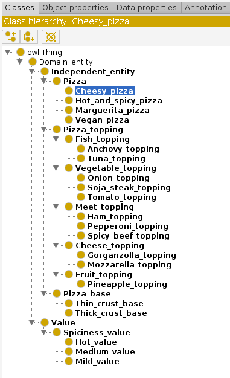

# Définition du squelette de la hiérarchie

Dans cette section, nous allons peupler notre ontologie afin qu'elle représente notre problème. Pour ce faire, nous allons procéder avec une approche *top-bottom* qui va consister à déclarer d'abord les **classes principales**, puis définir leurs **ramifications taxonomiques**.

## Création des classes principales

De la même manière que dans la section précédente, nous allons utiliser l'assistant [Create Class Hierarchy...](step2.md/#definir-la-hierarchie-haute-par-default) (*CCH*) pour construire notre hiérarchie de classes principales.


Il est tout a fait possible de faire cette opération à la main. Cependant, l'assistant permet d'indiquer des suffixes et des préfixes qui seront adjoints automatiquement aux éléments dans les classes principales. Pratique pour ne pas retaper `_topping` ou `_crust` à chaque fois !


1. Sélectionnez `Independent_class` ;
2. Allez dans `Tool > Create Class Hierarchy...` (le *CCH*) puis rentrez :
```
Pizza
Pizza_topping
Pizza_base
```

Laissez la boîte cochée pour les classes disjointes. Chaque élément est bien disjoint des autres !


Le tout devrait ressembler à cela


## Création des ramifications taxonomiques

Maintenant, on va s'intéresser à peupler ces classes principales avec des individus plus spécifiques.

### La garniture

1. Sélectionnez `Pizza_topping` ;
2. Ouvrez le *CCH*, et renseignez les garnitures que vous souhaitez représenter (pas besoin de rajouter `_topping` à la fin). N'oubliez pas que vous pouvez concevoir une hiérarchie de classe. Par exemple, vous avez une garniture fromage, qui elle même contient plusieurs fromage ! ;
3. Dans la partie `Suffix`, inscrivez `_topping`. Cela aura pour effet de rajouter `_topping` à toutes vos (sous-)classes.

Un exemple de hiérarchie

```
Meet
    Spicy_beef
    Ham
    Pepperoni
Fish
    Tuna
    Anchovy
Vegetable
    Soja_steak
    Tomato
    Onion
Fruit
    Pineapple
Cheese
    Mozzarella
    Gorganzolla
```

Vous devriez avoir quelque chose qui ressemble à cela, modulo les garnitures que vous avez choisis



Votre (sous-)ontologie concernant la garniture est prête. Il ne reste plus qu'à faire la même opération pour les deux autres classes `Pizza` et `Pizza_base`.


### La base

Un exemple de pâte à pizza

```
Thick_crust
Thin_crust
```


N'oubliez pas de rajouter le suffixe `_base` dans le CCH !


### Les pizzas

Un exemple de type de pizza qui existe

```
Hot_and_spicy
Cheesy
Vegan
Marguerita
```

Cette fois ci, décochez la boîte pour les classes disjointes. Certaines seront l'unions d'autres, on vera après !


## Quelques concepts de valeur : la force de la Pizza !

On aime bien quand ça pique, donc on va rajouter également le côté épicé dans notre ontologie. Puisqu'il peut avoir différentes valeurs (*e.g.* forte, médium...), il convient mieux de le mettre dans la section `Value` de notre hiérarchie de concepts.

```
Spiciness
    Hot
    Medium
    Mild
```


N'oubliez pas de rajouter le suffixe `_value` dans le CCH !



N'oubliez pas ce qui suit !


1. Cliquez sur `Spiciness_value` (ou votre classe qui subsume vos valeurs) ;
2. Aller dans `Edit > Add Covering Axioms` (vous verrez alors que votre `Spiciness_value` devient également une sous classe de vos valeurs).


OWL est défini selon le principe de "monde ouvert" : ce qui est omis existe peut être. Quand vous indiquez par exemple qu'il existe trois valeurs pour la `Spiciness`, si vous ne "couvrez pas" cette classe, le raisonneur va supposer qu'il peut exister d'autres éléments, empêchant par exemple l'identification d'éléments équivalent.


## Qu'est-ce qu'on vient de faire ?

Dans cette section, nous venons d'étoffer notre ontologie en la détaillant via des classes spécifiques. Cela nous permet de lister les différents concepts qui interviennent dans le "monde de la pizza".



Vous avez appris à créer des classes et des sous-classes via le *CCH* qui représentaient votre conception du monde de la pizza. Vous avez également appris à définir des concepts valeurs, et à "fermer le groupe" (*i.e.* dire que ce sont les seuls valeurs possibles).

Notez cependant que **ce ne sont pas des individus** mais bien des concepts, même les classes dans `Pizza` : elles représentent le concept d'une pizza Vegan, d'une pizza Margarita, etc.