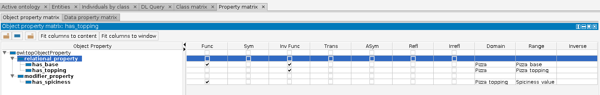

# Définition des propriétés des objets

Dans cette section, nous allons apprendre à créer les propriétés qui vont nous servir à lier les différentes classes les unes les autres, et spécifier leurs propriétés (cf. [ici pour un rappel](../ke/owl.md/#proprietes-des-relations)).


Pour la suite de cette section, n'oubliez pas de changer d'onglet et d'aller dans `Object property`. Le tour des fenêtres doit être bleu (et non pas vert ni jaune !).


## Les propriétés induites par le Top Level

Dans l'[Étape 2](step2.md), nous avons créé un top level avec `Independent_entity` et `Value` pour nous permettre de bien organiser nos éléments. La résultante de ça est qu'il existe donc des propriétés qui vont venir modifier certains concepts, comme le laisse transparaître `Spiciness_value` qui sera appliqué à `Pizza`.

On aura donc deux propriétés sur nos objets, une relationnelle et une pour "modifier" l'objet. Vous pouvez les créer manuellement, ou bien utiliser dans `Tool` l'option `Create Object Property Hierarchy...`.

```
relational_property
modifier_property
```


N'oubliez pas de sélectionner `owl:topObjectProperty` avant de faire appelle au COPH pour que les deux propriétés créés se retrouvent bien "en dedans" (soit subsumées).


## Les propriétés de notre modèle

Maintenant que nos deux propriétés principales sont créées, nous allons nous occuper de créer celles de notre modèle.

### Les propriétés relationnelles

On l'a vue lors de l'[élaboration de notre dictionnaire](step1.md), on va vouloir représenter le fait qu'une pizza possède une (ou plusieurs) garniture, ainsi qu'une pâte.

Aussi, cliquez sur `relational_property` puis dans le COPH, rajoutez simplement

```
has_topping
has_base
```

Maintenant que les deux propriétés relationnelles existent, on va les spécialiser. Autrement dit, on va dire ce qu'elles concernent pour véhiculer une sémantique bien précise : lorsqu'on parle de `has_topping` on veut simplement que cela concerne la garniture d'une pizza, pas vrai ?

1. Cliquez sur l'onglet `Property matrix` ;
2. Sélectionnez d'abord la propriété `has_topping` (surbrillance bleue) :
3. 1. On va dire d'où elle "part". Dans la colonne `Domain`, tapez `Pizza` (un `Ctrl + Espace` vous fait une auto-complétion). C'est la pizza qui est concernée par la garniture !
3. 2. Posséder de la garniture signifie qu'on parle de garniture ! Dans la colonne `Range`, tapez `Pizza_topping`. Et voila, maintenant, on englobe toutes les sortes de garnitures (fromage, viandes, etc.).
3. 3. Indiquez cette propriété comme étant inversement fonctionnelle en cochant la boite correspondante (c'est la garniture qui conditionne le type de pizza)
4. Sélectionnez la propriété `has_base` :
4. 1. Dans `Domain`, indiquez `Pizza` ;
4. 2. Dans `Range`, indiquez `Pizza_base` ;
4. 3. Dans les propriétés cochez fonctionnelle et inversement fonctionnelle (on individualise les deux côtés)

### Les propriétés de mutabilité

On va maintenant chercher à exprimer le degré de force de la pizza. Le point de détail est que le côté épicé de la pizza dépend de la garniture et non pas de la pizza elle même. 

Aussi, revenez dans l'onglet `Object Property`, puis :

1. Créez une nouvelle propriété `has_Spiciness`, cette fois ci rattaché à `modifier_property` ;
2. Dans `Domain`, indiquez `Pizza_topping` ;
3. Dans `Range`, indiquez `Spiciness_value` ;
4. Cochez la case fonctionnelle.

Et voila !

## Qu'est-ce qu'on vient de faire ?

Dans cette partie, vous venez de créer vos premières propriétés (relations) entre vos classes, et **surtout**, vous les avez liés entre elles.



Vous avez également appris qu'associer une relation à une classe qui en subsument d'autres impliquent que ces mêmes **classes subsumées sont aussi concernées** par cette relation ! C'est pour cela qu'on va pouvoir par exemple associé à une pizza fromage la garniture fromage, alors que nous avons seulement spécifié les relations avec les classes "parentes".