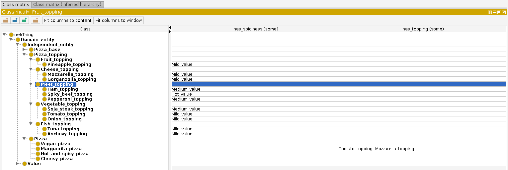

# Mise en relation des classes (Étape 5)

Dans cette section, nous allons voir comment associer les classes les unes les autres grâce aux propriétés que nous venons de créer dans la [section précédente](step4.md).


Nous utilisons encore une fois le plugin `Matrix View` ; si vous ne l'avez pas installé, il s'agit juste d'un moyen plus commode pour modifier un grand nombre de classes d'un coup, sans avoir à modifier une par une leurs informations.


Rendez vous dans l'onglet `Class Matrix` pour la suite.

## Ajouter la garniture et le piment à nos pizza

### Préparer la `Matrix View`

Dans la vue matricielle de classes, le volet central doit être actuellement vide. On va charger les deux propriétés qui nous intéresse pour le moment : `has_topping` et `has_spiciness`.

Pour ce faire, cliquez sur le bouton bleu `Add Object Property Column to Matrix` en haut de l'arborescence de vos classes.

Sélectionnez les deux propriétés et validez. Vous devriez voir deux nouvelles colonnes dans la zone centrale maintenant.


Prenez garde à ce que la restriction sur la relation soit de type `Some` (et non pas `Only`). On veut qu'une pizza fromage soit composer de fromage (mais ce n'est pas obligé qu'il n'y ait que ça !).


### Renseigner le piment de la pizza

De la même manière qu'avec les propriétés, l'idée est d'attribuer à chaque classe une valeur de piment grâce à la relation `has_spiciness`.

Par exemple, pour la classe `Spicy_beef`, indiquez dans la case en face et dans la colonne `has_spiciness` la valeur `Hot_value`.


Souvenez vous, vous pouvez exprimer cette règle comme étant $$\text{has_spiciness}(x,y), \text{Spicy_beef}(x), \text{Hot_value}(y)$$.


Répéter l'opération pour les différentes garnitures pour compléter les relations. 


On aurait pu utiliser notre connaissance experte pour renseigner manuellement **Hot_and_spiccy_pizza**, mais on a un moyen automatique basé sur les relations et classes qui nous permet de le faire de manière élégante (surtout si la définition est complexe).



Attention à ne pas affecter à une classe parente de valeur de piment ; ce serait en effet étrange (et surtout faux !) de dire que toutes les garnitures vegans sont très pimentés par exemple.


### Renseigner la composition de la pizza

On va maintenant s'intéresser à la composition des pizzas ; néanmoins, on ne vas pas toutes les définir ici car nous en utiliserons certaines pour présenter des expressions plus complexe par la suite.

Intéressons nous à la margarita : indiquez qu'elle est composé de `Tomato_topping` et de `Mozarella_topping`. Vous pouvez séparer les éléments avec une `,` (virgule).

Laissons le reste comme cela pour le moment !

## Qu'est-ce qu'on vient de faire ?

Dans cette section, nous venons de voir comment utiliser des propriétés que nous avons créés précédemment pour simplement spécialiser et renforcer nos définitions de classes.

