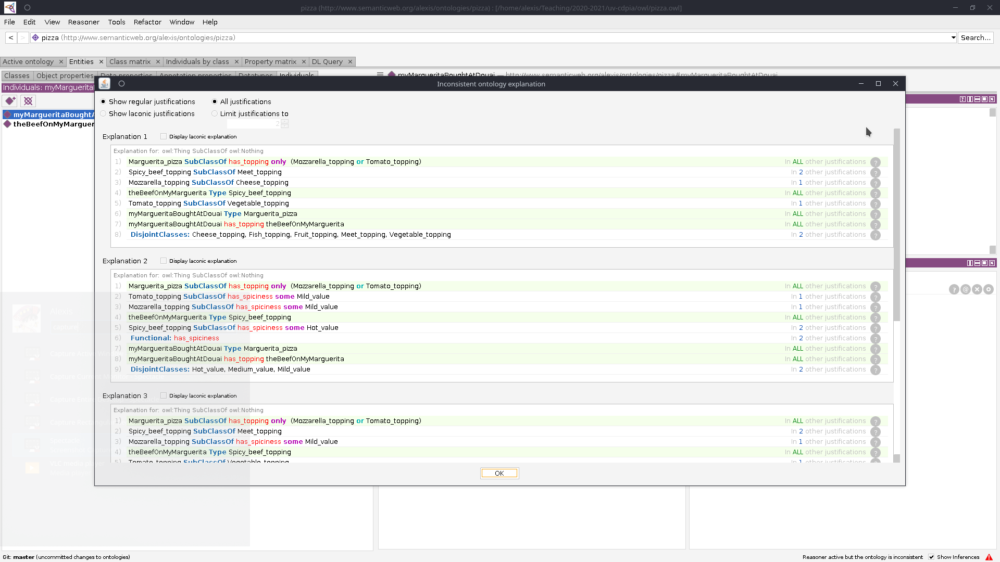

# Classification et vérification (Étape 7)

## Utiliser le raisonneur

L'ontologie n'est pas considérée comme complète tant que vous ne l'avez pas classifiée et vérifiée ! Autrement dit, vous allez lancer un raisonneur sur votre ontologie, et ce dernier va vérifier les inconsistences éventuelles, identifier les éléments qui sont équivalents, trouver de nouvelles informations à partir de votre base de faits, etc.


Il est important de sauvegarder votre travail ! Faîtes le ici si ce n'est pas déjà fait !


Choisissez d'abord votre raisonneur. Pour ce faire `Reasonner > HermiT 1.4.3` (c'est le raisonneur par défaut).

Une fois le raisonneur sélectionné, lancez le en faisant `Reasonner > start reasonner`. Vous verrez alors que des informations supplémentaires vont apparaître petit à petit (surbrillance jaune dans la zone de description), notamment au niveau du champ `subClassOf` de vos Pizza.

Dans l'[étape 6](step6.md/#fermons-notre-margarita) concernant la margarita vous avez réalisé l'étape optionnelle 5, vous devriez alors avoir un champ rouge qui apparaît :

En réalité, il n'existe aucun individu capable de respecter les quatres critères que nous avons énoncé, d'où le `owl:Nothing`. Pour régler se problème, vous devez **relaxer** les contraintes : remplacer le `and` par un `or`, relancer votre raisonneur, et votre ontologie passe ! Yay !


Pourquoi cette erreur ? Rappelez vous : nous avons définis `Cheese_topping` et `Tomato_topping` comme disjoint, donc ils ne peut pas y avoir d'intersection ! Il est fort ce raisonneur !


## Un mot sur la A-Box

Tout ce tutoriel s'est concentré sur la **T-Box** de l'ontologie, autrement dit toutes les classes et les propriétés qui existent entre ces classes et qui modélisent votre problème.

Brièvement tout de même, explorons comment faire.

Imaginons que nous voulions parler d'une margarita spécifique, présente sur notre table, achetée à Douai : il ne s'agit alors plus d'un concept, mais d'une instance de ce concept - un **individu**. On remarque que sur notre margarita, il y a des morceaux de viande.

1. Dans l'onglet `Individual` créez un nouvel individu (appelez le comme vous voulez)
2. Dans son champ `Type` dans la zone de description, ajoutez `Margarita_Pizza`
3. Rajouter un nouvel individu qui représentera la viande sur votre pizza
4. Sélectionnez à nouveau votre pizza, et dans le champ `Object Property Assertions` ajoutez : `has_topping leNomDeVotreIndividuQuiReprésenteLaViande`
5. Lancer de nouveau le raisonneur.

**Badabomm !**

Ce qu'il se passe, c'est que votre raisonneur remarque une incohérence entre votre T-Box et votre observation dans la A-Box : une margarita **ne peut pas avoir** de viande. Aussi, votre raisonneur vous dit qu'il y a un problème. Pour le corriger, il suffit simplement de ne mettre que de la garniture tomate ou fromage.

Vous pouvez aller beaucoup plus loin ! Par exemple, créez un nouvel individu qui représentera le goût de votre pizza, mais ne lui donnez pas de type. Retirez également le type de votre individu garniture, et rajoutez lui l'`Object Property Asserstions` : `has_spiciness votreGoutIndividu`.

Relancer le raisonneur, et vous verrez que ce dernier à inférer le type des éléments !