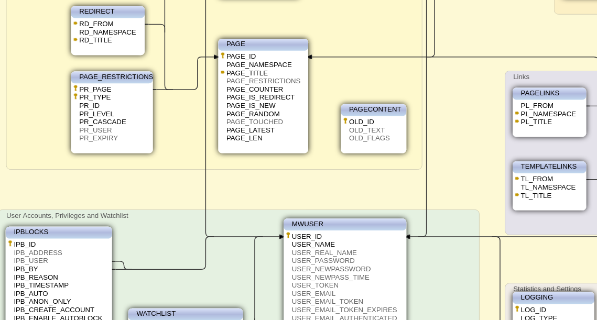

# Base de données

Les bases de données, ça, vous devez déjà connaître !

En réalité, c'est un paradigme de **structuration** et de **description** de l'information à des fins de stockage et, bien souvent aussi, d'accès.

Les informations stockées dans un BdD peuvent être **très structurées** : c'est le cas des bases de données dîtes relationnelles, classiquement utilisées \(MySQL, etc.\). Mais ces informations peuvent aussi être \(très peu\) structurées, comme avec NoSQL qui est assimilable à un immense tableau associatif.


Les géants du web ont depuis bien longtemps abandonnés les SGBD relationnels car leur performance devient médiocre avec un très important volume de données : c'est là la contre partie de la structuration de la donnée pour intégrer des contraintes supplémentaires sur l'information.


Dans tous les cas, des choix concernant comment représenter l'information doivent être faits, et des liens entre ces informations doivent apparaître. Mais ce n'est pas pour autant que l'information est **sémantisée**. Les relations ne sont pas explicites, et il n'y a aucune implication logique entre les différents éléments.

C'est aux concepteurs d'interpréter, de raisonner et d'inférer l'informations qui existent dans ces modèles. C'est d'ailleurs une limitation importante lorsque l'on veut utiliser des données disponibles dans des moteurs d'inférences : il faut préalablement traiter la donnée, par exemple en la labélisant, pour ensuite pour l'exploiter, ainsi que définir les règles entre ces données.

D'autres paradigmes sont bien plus efficaces pour l'ingénierie des connaissances, notamment sur le plan du raisonnement de l'information.

