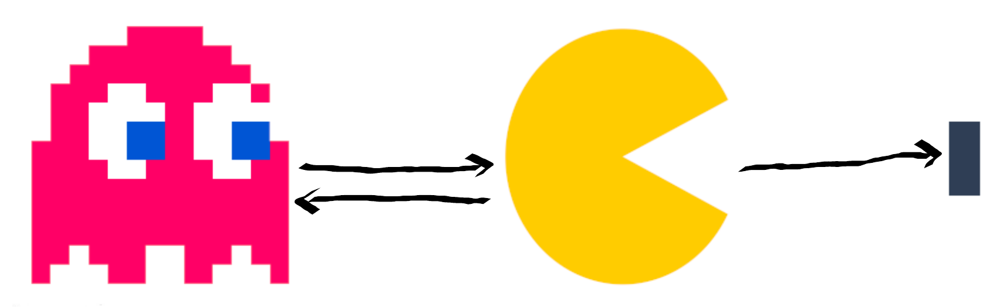

# Logique des prédicats

## Introduction

Avec la logique des prédicats \(ou d'ordre 1\) - **FOL** - on passe un cran au dessus en terme d'expressivité des phrases, puisqu'il est possible d'exprimer, entre autre, la notion de variabilité dans une proposition, qui se nomme alors un **prédicat** \(smullyan1995first\). Incidemment, elle devient plus difficilement satisfiable.

Avec cette logique, on peut totalement modéliser des systèmes complexes, capables d'exploiter une base de connaissances et de faits pour raisonner efficacement et produire de l'information.


Une base de connaissance est un ensemble de faits connus \(_i.e._ des constantes\), par exemple Homme\(Socrate\).


Formellement, un prédicat se définit comme :

> une expression linguistique qui peut être reliée à un ou plusieurs éléments du domaine pour former une phrase [\[source\]](https://fr.wikipedia.org/wiki/Calcul_des_pr%C3%A9dicats).

## Syntaxe

### Alphabet

* Un ensemble de termes variables, toujours infini mais dénombrables : $$x,y,z\ldots$$
* un ensemble de termes constants, qui peut être soit $$\emptyset$$, soit $$a,b,c\ldots$$
* Un ensemble de prédicats $$\mathcal{P}$$ \(ou relations\) : $$P, Q, R\ldots$$
* Un un ensemble de connecteurs : $$\wedge$$, $$\vee$$, $$\lnot$$, $$\rightarrow$$ $$\ldots$$
* Deux quantificateurs : $$\forall$$ \(**pour tous**\) et $$\exists$$ \(**il existe**\)


L'ordre des quantificateurs est important !

* $$\forall x\exists y \hspace{0.1cm} x^2+y < 0$$
* $$\exists y\forall x \hspace{0.1cm} x^2+y < 0$$ !! Jamais vrai 


### Arité

$$\forall P \in \mathcal{P}$$, $$P$$ possède une arité \(_i.e._ le nombre de variables et de constantes qui interviennent\).

Par exemple :

* le prédicat `pere` est dit **dyadique** puisque pour être le père de quelqu’un, deux entités sont concernés. On note cela 

  ```cpp
  pere(x,y) //x est le père de y
  ```

* le prédicat `grand` est dit **monoadique** puisqu'un seul individu est concerné. Il s'exprime comme

  ```cpp
  grand(x) //x est grand
  ```

### Formule

Une formule du calcul des prédicats \(_i.e._ mot\) se définit par **induction**.


Vous avez un [Glossaire](../annexes/glossary.md) à disposition.


Soit $$n_P$$ un poids associé à chaque prédicat $$P \in \mathcal{P}$$. $$P(x_1,x_2\dots x_n)$$ est une formule _ssi_ $$P$$ est de poids $$n$$.

_Exemple :_

> * `pere(x,y)` est un mot ;
> * `grand(x,y)` n'est pas un mot puisqu'il est monadique.

De plus, une formule qui ne possède **que** des **variables liées** est appelée un **enoncé**.

* Lorsqu'une variable est associée à un quantificateur \(_e.g._ $$\forall x, P(x)$$\), on dit qu'elle est liée ;
* Inversement, lorsqu'une variable n'est pas associée à un quantificateur, on dit qu'elle est libre.

L'exemple ci-après illustre le célèbre syllogisme de Socrate, que l'on ne peut pas exprimer en _ZOL_.

> $$\forall x \hspace{0.1cm} (humain(socrate) \wedge (humain(x) \rightarrow mortel(x)))\rightarrow mortel(socrate)$$

## Modèle

Un modèle du langage permet son interprétation en y décrivant les valeurs prises par les éléments du premier ordre \(variables, constantes...\) et les formules associées. Chaque **énoncé** se voit attribué une valeur de vérité. Un modèle donne donc un sens aux symboles du langage : l’on parle alors de sémantique.



Un **modèle donne une valeur de vérité** \(vrai ou faux\) à toute formule close du langage. Les conditions de vérité sont définis par induction structurelle sur les formules. Par exemple, dans le modèle ci-contre :

* $$\forall x \exists y \hspace{0.1cm} eat(x,y)$$ $$\leftarrow$$ FAUX \(le "pellet" ne mange persone\)
* $$\forall x \exists y \hspace{0.1cm} eat(y,x)$$ $$\leftarrow$$ VRAI \(il y a toujours quelque chose qui est mangé\)

## Raisonnement

### Règles

Dans la logique des prédicats, il est possible de dynamiquement augmenter la base de faits disponibles en s'appuyant sur des raisonnements adossés à des règles.

Exemples :

* $$\forall x \exists y \hspace{0.1cm} grandpere(y,x) \leftrightarrow \forall x\exists z, y \hspace{0.1cm} pere(z,x) \wedge pere(y,z)$$
* $$\forall x \exists y \hspace{0.1cm} grandmere(y,x) \leftrightarrow \forall x\exists y \hspace{0.1cm} ancetre(y,x) \wedge femme(y)$$

Aussi, si on sait que `grandmere(Anna,Bob)` \(_i.e._ que Anna est la grand mère de Bob\), on peut en déduire que Anna est une femme grâce à `femme(y)`, sans même l'avoir spécifié dans la base de fait. Autrement dit, on a **inféré** cette connaissance !


Cette information peut venir enrichir la base de faits, et ensuite être utilisée dans des raisonnements _a postériori_.


### Quelques pièges

Quand ont définit des règles/formules/énoncés il faut être prudent avec les implications qu'elles peuvent avoir. Autrement, l'on cours à des incohérences dans les faits.


Disons que $$\forall x, \hspace{0.1cm} oiseau(x) \wedge ailes(x) \rightarrow vole(x)$$ ... et les pingouins dans cette histoire ?


Parmi les pièges les plus courants :

* Créer des chemins de règles qui amène $$x$$ à être vrai quoi qu'il arrive \(_i.e._ x est "tout"\) ;
* Règles trop génériques, ou à l'inverse trop exclusives ;
* Des règles insolubles nécessitant de $$x$$ d'être à la fois vrai et faux, afin que le prédicat soit vrai.

### Inférence

On l'a vu dans la [section précédente](fol.md#regles), il est possible de créer de l'information à partir de la base de faits et de règles. Ce mécanisme, communément appelé **inférence**, repose sur différents ressorts d'interprétation des connaissances à disposition du moteur d'inférence \(induction, déduction, chaînage...\).

Le **chaînage** est un procédé puissant permettant d'exploiter au maximum les énoncés du modèle. À partir d'un ensemble d'énoncés initiaux et de faits, le moteur va faire croître sa base de faits en fonction des résultats, et recommencer l'application des règles jusqu'à ce qu'il n'y ait plus de changement entre deux itérations.

_Exemple 1 \(chaînage avant\) :_

> Soit les règles suivantes :
>
> * $$\forall x \exists y, \hspace{0.1cm} grandmere(y,x) \leftrightarrow \forall x\exists y \hspace{0.1cm} ancetre(y,x) \wedge femme(y)$$
> * $$\forall x, y, \hspace{0.1cm} femme(x) \wedge homme(y) \wedge averageSmaller(x,y)$$
>
> Et le fait suivants :
>
> * `grandmere(Anna,Bob)`
> * `homme(Bob)`
>
> Avec un chaînage avant, on en déduit que Anna est une femme \(`femme(y)`\) **puis** que Anna est probablement plus petite que Bob.


Le chaînage arrière fonctionne pareil, à la différence qu'au lieu de partir des prémices, l'on part des conclusions et on "remonte à l'envers" les règles.


_Exemple 2 \(chaînage mixte\):_

> De telles inférences peuvent rapidement devenir utiles en situation réelle. Admettons que vous avez, sur une chaîne de production, cinq machines différentes \(_i.e._ qui font des actions différentes\) :
>
> * `pli(b,c)`
> * `cut(c,b)`
> * `transform(a,b)`
> * `livrable(c,b,d)`
> * `livrable(e,d)`
>
> Admettons aussi que votre produit final est `d`, et que, pour une raison ou pour une autre, une pénurie de ressources se manifeste et ne vous laisse plus que `a` comme matière première. En utilisant un chaînage mixte, vous savez que pour que `d` soit vrai, il vous faut $$(b \wedge d) \vee e$$. Avec un chaînage avant, vous savez qu'avec `a` vous pouvez produire `b`, et avec `b` produire `c`. Le process de production final déduit est alors :
>
> transform $$\mapsto$$ pli $$\mapsto$$ livrable

## Conclusion

La **FOL** est utilisé dans des algorithmes d'**intelligence artificielle**, pour résoudre des **problèmes d'optimisation**, de **jeux**...

Elle donne aussi un cadre intéressant aux mécanismes d'inférences et de déduction pour produire de l'informations supplémentaires et du [DM](../aide-a-la-decision-decision-making-or-dm/intro_dm.md). C'est par exemple le cas avec les chaînages, comme on l'a vu juste avant.

C'est sur ces principes que la notion de **systèmes experts** est apparues \(~1963\). Il s'agit d'une implémentation informatique capable de simuler les mécanismes cognitifs d'un expert, dans un domaine particulier, pour répondre à des questions.

Il y a des **avantages** et des **désavantages** à ces systèmes. Une petite liste

| Pros | Cons |
| :---: | :---: |
| Explicabilité des résultats | Recueil des connaissances complexe et fastidieux |
| Complet | Semi-décidable |
| Maintenance et évolution | Un modèle volumineux peut devenir complexe à maintenir |
| Humainement compréhensible |  |

