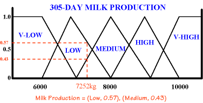
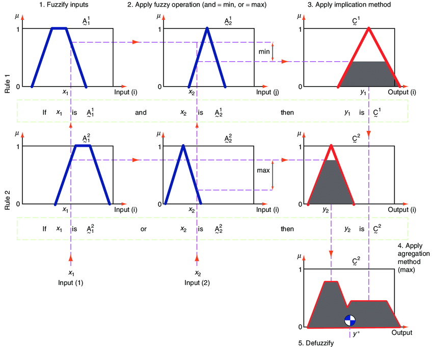

# Logique flou

## Introduction

Encore de la logique ?!


Et oui, il y a beaucoup d'autres logiques, allant de celles simples comme celle des propositions à la logique dynamique introduisant la notion d'action en plus \(par exemle $$(x>6)\rightarrow [x:=x*2](x>12)$$\), utilisé pour la vérification de programme informatique.


Néanmoins, la plupart de ces logiques sont qualifiées de **crisp** \(oui, oui, comme les gâteux apéro\) : ils prennent une valeur de vérité dans un interval **discret** sémantisé _a priori_, généralement {`0`,`1`}, avec `0 = FAUX` et `1 = VRAI`.

Les ensembles flous et la logique floue s'établissent plutôt en rupture de toutes ces logiques _crisp_. L'idée est de travailler avec un intervalle **continu** de valeur comprise entre `[0;1]`, qui représente l'appartenance d'un concept à un ensemble donné.

Intuitivement, pour comprendre le besoin, l'on peut se poser la question du tas de sable : À quel moment, en empilant un par un les grains de sables, l'on peut parler de **tas** de sable ? La logique floue apporte une modélisation mathématique à cette question.

_Exemple :_

> La variable `Bob` appartient à l'ensemble `grand`, _t.q._ grand\(Bob\), avec un **degré** de 0.67, et la variable `Anna` avec un degré de 0.35. Avec ces information, l'on peut commencer à faire du raisonnement.


Le notion de degré est différente de celle de probabilité ! La probabilité est **crisp** ! En effet, si vous avez $$P(x)=0.67$$ t.q. $$x \in \text{grand}$$ cela signifie que $$x$$ a 67% de chance d'être grand \(_i.e._ que ce soit vrai\), et 23% de chance d'être faux. En _fuzzy_, il est, pour une unité, "0.67 grand et 0.23 petit".


Pour définir le degré d'appartenance d'une variable $$x$$ \(_e.g._ une mesure\), on procède à une **fuzzification**. On peut ensuite faire des opérations mathématiques simulant les connecteurs vue dans la [ZOL](zol.md) et la [FOL](fol.md). Néanmoins, il n'est pas possible d'interpréter avec des valeurs de vérité les résultats : il faut tout d'abord les faire sortir de ces ensembles flous, ce que l'on appelle la **defuzzification**, pour ensuite leur attribuer une valeur de vérité.


Les connecteurs logiques ne sont plus définis universellement !


## Fuzzification

Dans les grandes lignes, on définit $$s_1,\ldots ,s_n, n \in \mathbb{N}$$ comme des ensemble flous, t.q. $$s \in \mathcal{S}$$ \(l'ensemble de nos ensembles flous\). On définit également $$m_s$$, la fonction d'appartenance à l'ensemble flou \(_membership function_\) $$s$$ comme $$m:\mathbb{R} \mapsto [0;1]$$.

La fonction de fuzzification $$\mu: x \mapsto [0;1]^n$$ consiste à prendre une variable $$x$$ et la projeter dans nos ensembles flous, pour définir un degré d'appartenance pour chacun des ensembles.

Avec cette approche, les informations deviennent humainement interprétables. Il est même possible d'introduire des modificateurs sémantiques \(_e.g._ peu, énormément,etc.\).

## Pipeline de la FZL

Pour pouvoir faire de la logique avec ces ensembles, il faut définir nos connecteurs. Comme spécifié dans l'[Introduction](fzl.md#introduction), les connecteurs ne sont plus universels. Aussi, accordons nous sur leur définition :

* **AND** $$\approx$$ $$min(m_{s_i}(x),m_{s_j}(x))$$
* **OR** $$\approx$$ $$max(m_{s_i}(x),m_{s_j}(x))$$

Maintenant que nos connecteurs sont définis, on a tout le pipeline nécessaire pour réaliser de la logique flou :

1. Définir nos ensembles flous
2. Définir nos règles logiques \(_e.g._ si le service est mauvais ou la nourriture mauvaise, alors le pourboire sera faible\)
3. _Fuzzifier_ les variables \(_e.g._ la qualité de service et la qualité de la nourriture\)
4. Appliquer les opérateurs logiques
5. Défuzzifier \(là encore, ce n'est pas défini universellement\)

Grâce à cela, on est capable de raisonner dans l'incertitude, et prendre des décisions à l'échelle de la compréhension humaine, plutôt que de travailler avec des métriques abstraites.


La qualité d'un modèle logique floue est reportée sur l'élaboration de ses ensembles flous et des fonctions d'appartenances associées. Il est parfois difficile de modéliser correctement ces fonctions dû à la complexité inhérente des concepts ; des fois il est possible de les éclater en sous concept.


## Ressources intéressantes

Deux trois ressources intéressantes :

* [Une introduction au niveau à la FZL](https://www.researchgate.net/publication/267041176_Introduction_a_La_Logique_Floue)
* [La logique floue de Zaddeh](http://www.geocities.ws/hhvillav/00000053.pdf)

