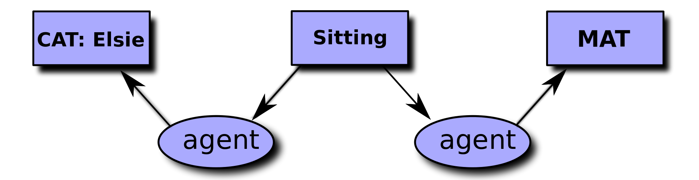

# Graphe conceptuel

## Introduction

En 84, **J. Sowa** \(sowa1984conceptual\) propose un formalisme de représentation des connaissances et de raisonnement nommé **Graphe Conceptuel** \(ou graphe de concepts\) qui a vocation à expliciter les entités \(les noeuds du graphe\) et les relations qui existent entre ces entités \(les arcs du graphe\).


Le force d'un GC est de ne pas être tant complexe que cela à appréhender pour un humain sans background en informatique ou logique.

## Utilisation

Par essence, un GC permet de sémantiser l'information. Dans l'exemple précédent, on sait qu'à la fois le renard et le corbeau sont des agents.

Une boîte se nomme un **noeud conceptuel** et un ovale une **relation conceptuelle**.

On peut faire un graphe conceptuel pour approximativement tout. Par exemple, le schéma de base de données présenté dans la section [Base de données](bdd.md) peut facilement être traduit en graphe conceptuel.

_Exemple :_

> Une \[page\] \(est écrite par\) \[Bob\] et \[Bob\] est un \(agent\).


Il existe un standard pour modéliser un graphe conceptuel, nommé _Conceptual Garphs Interchange Format_ [\[source\]](http://www.jfsowa.com/cg/annexb.htm).


Si on regarde plus en détail le graphe conceptuel suivant...



... **Que remarquez-vous ?**

On voit des prédicats émerger de ce graphe de concept, comme par exemple `agent` !

En effet, l'un des atouts des GC est de pouvoir servir **d'interface graphique** pour la _FOL_ \(modulo quelques interprétations\). Il est aussi **bijectif**, autrement dit à partir d'un graphe conceptuel, il est possible d'obtenir le modèle _FOL_ associé.

Par exemple, le GC ci-dessus pourrait par exemple se traduire \(d'abord en CLIF\) comme :

```text
 (exists ((x Sitting) (y Mat)) (and (Cat Elsie) (agent x Elsie) (location x y)))
```

Qui, ensuite, pourrait se traduire comme un énoncé en _FOL_ : $$\exists x,y\hspace{0.1cm} (Sitting(x) \wedge Mat(y)) \wedge ( Cat(Elsie) \wedge Agent(x, Elsie)) \wedge Location(x,y)$$.


Puisque un GC est bijectif, il est possible d'utiliser un moteur d'inférence sur ces formules \(_a.k.a._ algorithme de simulation des raisonnements déductifs, cf. [FOL-Inférence](fol.md#inference)\). On peut donc obtenir des conclusions supplémentaires en fonctions des noeuds et des relations conceptuelles : pratique pour **enrichir** la donnée ou **identifier** des inconsistances.


## Raisonner seulement _via_ les GC

Sans rentrer dans les détails, et pour votre culture, une autre approche proposée principalement par [Chein & Mugnier, 2008](../annexes/ref.md#chein2008) consiste à raisonner _**directement** via_ des opérations mathématiques sur les graphes \(homomorphisme de graphe\). Cette approche est souvent dénotée **Graph-based knowledge representation and reasoning model**.

Parmi ses avantages :

* Englobe plusieurs formalismes \(dont les ontologies\) ;
* Homomorphisme permet de se rattacher à des problèmes mathématiques déjà existants ;
* Semble être plus efficace \(en terme de complexité\) dans le raisonnement qu'une approche "classique" en _FOL_

