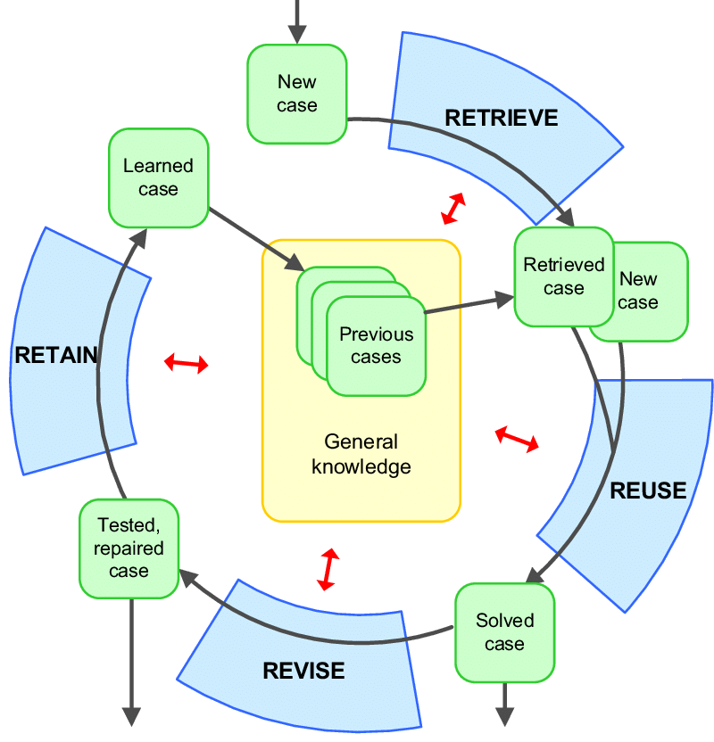

# Case Based Reasoning

## Introduction

Le **Case Based Reasoning** (CBR), ou raisonnement à partir de cas (RàPC), est un type de raisonnement basé sur la remémoration et l'adaptation d'anciens cas rencontrés et résolus pour en résoudre de nouveaux, souvent **similaires** [[Kolodner92]](../REF.md/#kolodner92).

Il repose sur des principes d'ingénieries des connaissances pour trouver les cas similaires et les adapter, et de l'aide à la décision pour expliquer pourquoi le cas proposé semble adéquat à la situation et prendre en compte les corrections utilisateurs aux propositions automatisées.

*Exemple :*
> Vous voulez faire un repas amical où plusieurs régimes alimentaires se côtoient. Vous vous souvenez de ce que vous avez individuellement préparé aux invités les dernières fois, et essayez de trouver l'union de ce qui convient le mieux, en faisant les modifications nécessaires.
> 
> Au cours du repas, vous prenez notes des éventuelles remarques de vos convives et, une fois le repas terminé, vous notez le tout pour plus tard -- au cas où : procéder, recettes ainsi que les feedbacks. Voila, vous faîtes du CBR !

## Overview

Le CBR est un type de raisonnement très intuitif, basé sur un "meta-schéma" cognitif humain, qui se décompose en quatres grandes parties :

* Remémoration
* Réutilisation
* Révision
* Mémorisation


Le cycle du CBR est généralement intimement lié à l'utilisateur. Les cas solutionnés sont ainsi souvent proposés à l'utilisateur pour prise de décision et révision avant d'être appliqué. Néanmoins, le CBR s'applique aussi à des systèmes automatisés : l'action est directement effectuée, et la réaction de l'environnement sur le système est déduit dans la révision.

