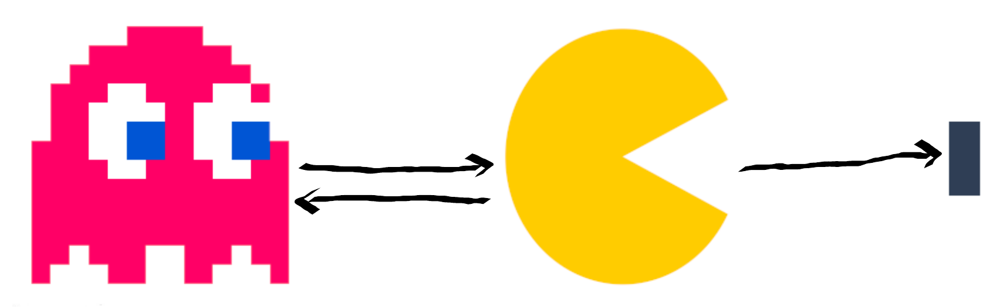

# Logique des prédicats

Avec la logique des prédicats (ou d'ordre 1) on passe un cran au dessus en terme d'expressivité des phrases, puisqu'il est possible d'exprimer, entre autre, la notion de variabilité dans une proposition, qui se nomme alors un **prédicat**. Incidemment, elle devient plus difficilement satisfiable.

Avec cette logique, on peut totalement modéliser des systèmes complexes, capables d'exploiter une base de connaissances et de faits pour raisonner efficacement et produire de l'information.


Une base de connaissance est un ensemble de faits connus (*i.e.* des constantes), par exemple Homme(Socrate).


Formellement, un prédicat se définit comme :
> une expression linguistique qui peut être reliée à un ou plusieurs éléments du domaine pour former une phrase [[source]](https://fr.wikipedia.org/wiki/Calcul_des_pr%C3%A9dicats).

## Syntaxe

### Alphabet

* Un ensemble de termes variables, toujours infini mais dénombrables : $$x,y,z\ldots$$
* un ensemble de termes constants, qui peut être soit $$\emptyset$$, soit $$a,b,c\ldots$$
* Un ensemble de prédicats $$\mathcal{P}$$ (ou relations) : $$P, Q, R\ldots$$
* Un un ensemble de connecteurs : $$\wedge$$, $$\vee$$, $$\lnot$$, $$\rightarrow$$ $$\ldots$$
* Deux quantificateurs : $$\forall$$ (**pour tous**) et $$\exists$$ (**il existe**)


L'ordre des quantificateurs est important !
* $$\forall x\exists y \hspace{0.1cm} x^2+y < 0$$
* $$\exists y\forall x \hspace{0.1cm} x^2+y < 0$$ !! Jamais vrai 



### Arité
$$\forall P \in \mathcal{P}$$, $$P$$ possède une arité (*i.e.* le nombre de variables et de constantes qui interviennent).

Par exemple :
* le prédicat `pere` est dit **dyadique** puisque pour être le père de quelqu’un, deux entités sont concernés. On note cela 
```c++
pere(x,y) //x est le père de y
```
* le prédicat `grand` est dit **monoadique** puisqu'un seul individu est concerné. Il s'exprime comme
```c++
grand(x) //x est grand 
```

### Formule
Une formule du calcul des prédicats (*i.e.* mot) se définit par **induction**.


Vous avez un [Glossaire](../GLOSSARY.md) à disposition.


Soit $$n_P$$ un poids associé à chaque prédicat $$P \in \mathcal{P}$$. $$P(x_1,x_2\dots x_n)$$ est une formule *ssi* $$P$$ est de poids $$n$$.

*Exemple :*
> * `pere(x,y)` est un mot ;
> * `grand(x,y)` n'est pas un mot puisqu'il est monadique.

De plus, une formule qui ne possède **que** des **variables liées** est appelée un **enoncé**.

* Lorsqu'une variable est associée à un quantificateur (*e.g.* $$\forall x, P(x)$$), on dit qu'elle est liée ;
* Inversement, lorsqu'une variable n'est pas associée à un quantificateur, on dit qu'elle est libre.

L'exemple ci-après illustre le célèbre syllogisme de Socrate, que l'on ne peut pas exprimer en *ZOL*.
> $$\forall x \hspace{0.1cm}  (humain(socrate) \wedge (humain(x) \rightarrow mortel(x)))\rightarrow mortel(socrate)$$

## Règles

### Règles et inférences

Dans la logique des prédicats, il est possible de dynamiquement augmenter la base de faits disponibles en s'appuyant sur des raisonnements adossés à des règles.

Exemples :
* $$\forall x \exists y \hspace{0.1cm} grandpere(y,x) \leftrightarrow \forall x\exists z, y \hspace{0.1cm} pere(z,x) \wedge pere(y,z)$$
* $$\forall x \exists y \hspace{0.1cm} grandmere(y,x) \leftrightarrow \forall x\exists y \hspace{0.1cm} ancetre(y,x) \wedge femme(y)$$

Aussi, si on sait que grandmere(Anna,Bob) (*i.e.* que Anna est la grand mère de Bob), on peut en déduire que Anna est une femme grâce à `femme(y)`, sans même l'avoir spécifié dans la base de fait. Autrement dit, on a **inférer** cette connaissance ! 


Cette information peut venir enrichir la base de faits, et ensuite être utilisé dans des raisonnements *a postériori*.


### Quelques pièges

Quand ont définit des règles/formules/énoncés il faut être prudent avec les implications qu'elles peuvent avoir. Autrement, l'on cours à des incohérences dans les faits.


Disons que $$\forall x \hspace{0.1cm} oiseau(x) \wedge ailes(x) \rightarrow vole(x)$$ ... et les pingouins dans cette histoire ?


Parmi les pièges les plus courants :
* Créer des chemins de règles qui amène $$x$$ à être vrai quoi qu'il arrive (*i.e.* x est "tout") ;
* Règles trop génériques, ou à l'inverse trop exclusives ;
* Des règles insolubles nécessitant de $$x$$ d'être à la fois vrai et faux, afin que le prédicat soit vrai.

## Modèle

Un modèle du langage permet son interprétation en y décrivant les valeurs prises par les éléments du premier ordre (variables, constantes...) et les formules associées. Chaque **énoncé** se voit attribué une valeur de vérité. Un modèle donne donc un sens aux symboles du langage : l’on parle alors de sémantique.



Un **modèle donne une valeur de vérité** (vrai ou faux) à toute formule close du langage. Les conditions de vérité sont définis par induction structurelle sur les formules. Par exemple, dans le modèle ci-contre :

* $$\exists x \exists y \hspace{0.1cm} eat(x,y)$$ $$\leftarrow$$ FAUX (le "pellet" ne mange persone)
* $$\forall x \exists y \hspace{0.1cm} eat(y,x)$$ $$\leftarrow$$ VRAI (il y a toujours quelque chose qui est mangé)

## Raisonnement

Fol \cite{smullyan1995first}