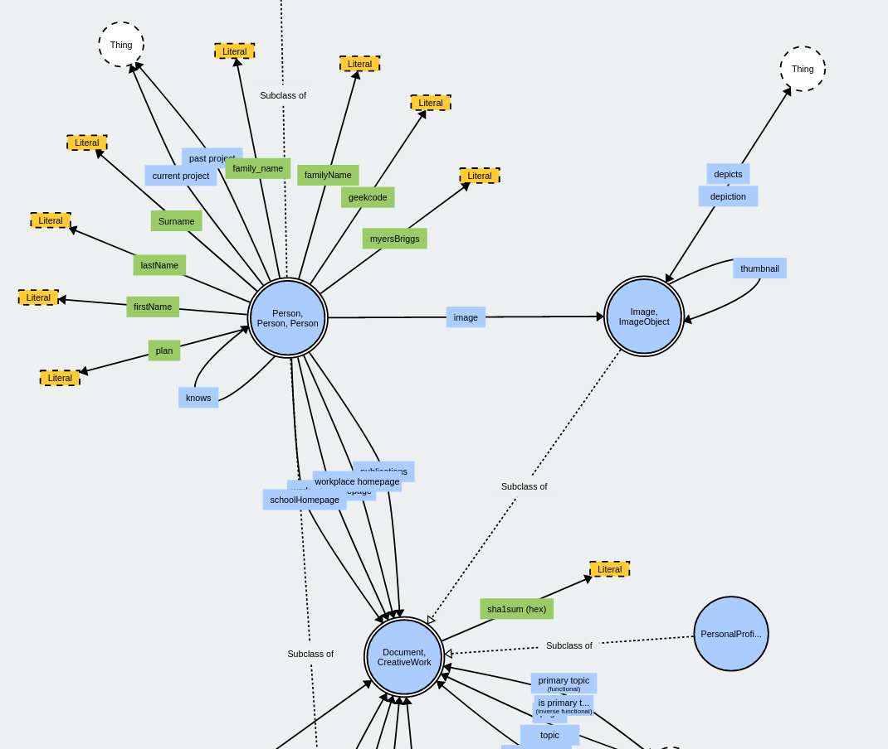

# Ontologie

## Introduction


Soyez attentif, on pratiquera sur les ontologies dans la section de [Mise en pratique](../handson/tuto.md).


L'ontologie, quelque soit le contexte dans lequel on la considère est un concept complexe à assimiler. On retrouve initialement le concept d'ontologie en philosophie, qui se définit comme :

> Partie de la philosophie qui a pour objet l'étude des propriétés les plus générales de l'être, telles que l'existence, la possibilité, la durée, le devenir. [CNRTL](https://www.cnrtl.fr/lexicographie/ontologie)

En informatique, la notion d'ontologie change quelque peut. Elle conserve sont caractère descriptif afin de capter les interrelations qui existent au sein d'une sous-partie d'un monde observé ; mais elle introduit surtout une notion forte de modélisation des éléments qui constituent ces interrelations : les "objets" et les "relations" qu'ils ont.


En un sens, une ontologie est un framework conceptuel d'un domaine précis, permettant de modéliser les éléments du discours, leurs relations et leurs caractéristiques sous la forme d'un graphe $$\mathcal{G}=(V,E)$$ où $$V$$ sont les éléments, et $$E$$ les relations.


La particularité d'une ontologie est qu'elle est bien plus qu'une simple taxonomie ; elle l'est d'une part : c'est un graphe qui décrit la hiérarchie des concepts (éléments **et** relations) impliqués. Ainsi, les concepts qui interviennent en bas de la taxonomie "héritent" des propriétés de leurs ancêtres.

Mais c'est également une taxonomie enrichie de relations logiques complexes qui interviennent entre les éléments du discours, comme l'appartenance à des groupes d'éléments, la symétrie d'une relation, l'exclusivité d'une relation et plein d'autres éléments.


On peut en effet faire de l'"héritage" sur les relations également ! Par exemple dire que `hasVeryGoodFriend(x,y)` "hérite" de `hasFriend(x,y)`.



On ne parle pas d'héritage, mais de subsomption ici.


Parmi ce concept existe les **ontologies pour le web sémantique**. Il s'agit d'un type d'ontologie particulier qui s'intéresse principalement à la cohérence logique et l'expressivité des éléments décrits pour **permettre le raisonnement automatique**. Pour cela, les langages de description de ces ontologies utilisent la [logique de premier ordre](fol.md) pour modéliser l'univers $$\Omega$$ qui nous intéresse. Conséquemment, les ontologies permettent de simuler le processus cognitif humain, ce qui les rend très pratiques pour les incorporer dans des processus d'IA où l'explicabilité et des relations complexes sont de mises.


Dans la suite, par le terme ontologie, on fera référence aux ontologies du web sémantiques.




Les étapes classiques pour l'élaboration d'une ontologie, d'après [Powell, 2015](../REF.md/#powell2015) :

1. Identifier votre **taxonomie** -- quels sont les éléments, les sous-éléments...
2. Quels éléments **non pas de relation** avec d'autres ?
3. Quels éléments "**héritent**" (*i.e.* sont des) de plusieurs éléments ?
4. Quels sont les **caractéristiques uniques** définissant un individu ?
5. Quels sont les **caractéristiques mesurables** d'un élément ?
6. Quels éléments sont **décrit par** l'entremise d'**autres éléments** ?

## Entités, relations

## A-BOX vs T-BOX

### Assertion component

```rdf
A est un B
```

```rdf
Bob est un Homme
```

### Terminological component

Tous les Étudiants sont des Personnes

Il y a deux types de personnes : des XX (Femme) et des XY (Homme).


## Propriétés des relations

Un propriété, appliquée à une relation, la conditionne et lui induit des contraintes supplémentaires qui seront utilisées lors du raisonnement.

Ce n'est pas obligatoire d'attribuer à une relation une propriété, mais cela peut aider à renforcer les contraintes d'intégrité du système que vous êtes en train de décrire.

Une relation peut donc avoir aucune, une ou plusieurs propriétés à la fois. Elles sont au nombres de 5 :

* Transitive (`owl;TransitiveProperty`)
* Symétrique (`owl;SymetricProperty`)
* Fonctionnelle (`owl;FunctionalProperty`) 
* Inverse de (`owl;inverseOf`)
* Fonctionnelle Inverse (`owl;InverseFunctionalProperty`)


Les exemples qui suivent proviennent tous de la [documentation officielle](https://www.w3.org/TR/2004/REC-owl-guide-20040210/#PropertyCharacteristics) concernant le Web Ontology Language (OWL) de la W3C


### Transitive

Si une propriété $$P$$ est spécifiée comme **transitive**, alors $$\forall x, y, z$$ on a : $$P(x,y) \wedge P(y,z) \rightarrow P(x,z)$$.

Autrement dit, pour une même propriété, si il existe "un chemin de cette propriété" entre $$x$$ et $$z$$, alors cette propriété s'applique aussi entre $$x$$ et $$z$$.

*Exemple :*
> ```rdf
> <owl:ObjectProperty rdf:ID="locatedIn">
>   <rdf:type rdf:resource="&owl;TransitiveProperty" />
>   <rdfs:domain rdf:resource="&owl;Thing" />
>   <rdfs:range rdf:resource="#Region" />
> </owl:ObjectProperty>
> 
> <Region rdf:ID="SantaCruzMountainsRegion">
>   <locatedIn rdf:resource="#CaliforniaRegion" />
> </Region>
> 
> <Region rdf:ID="CaliforniaRegion">
>   <locatedIn rdf:resource="#USRegion" />
> </Region>
> ```
> Ici, on définit que la région `SantaCruzMountainsRegion` est `locatedIn` (située dans) la région `CaliforniaRegion`, et que cette dernière est `locatedIn` la `USRegion`. Puisque `locatedIn` est transitive, on peut **en déduire** que `SantaCruzMountainsRegion` est aussi `locatedIn` la `USRegion` !

### Symétrique

Si une propriété $$P$$ est spécifiée comme **symétrique**, alors $$\forall x, y$$ on a : $$P(x,y) \leftrightarrow P(y,x)$$.

Autrement dit, si une propriété est symétrique, elle est vraie ou fausse, qu'importe le sens des termes.

*Exemple :*
> ```rdf
> <owl:ObjectProperty rdf:ID="adjacentRegion">
>   <rdf:type rdf:resource="&owl;SymmetricProperty" />
>   <rdfs:domain rdf:resource="#Region" />
>   <rdfs:range rdf:resource="#Region" />
> </owl:ObjectProperty>
> 
> <Region rdf:ID="MendocinoRegion">
>   <locatedIn rdf:resource="#CaliforniaRegion" />
>   <adjacentRegion rdf:resource="#SonomaRegion" />
> </Region>
> ```
> Ici, on définit en plus de la relation `locatedIn` la relation `adjacentRegion`, qui à pour domaine une `Region` et une portée de `Region`. La région `MendocinoRegion` est définie comme adjacente à la région `SonomaRegion`. On peut donc **en déduire** que `SonomaRegion` est aussi adjacente à `MendocinoRegion`. Par contre, il n'y a pas symétricité pour la relation `locatedIn CaliforniaRegion` concernant `SonomaRegion` : on n'a aucune information d'où elle est située.

### Fonctionnelle

Si une propriété $$P$$ est spécifiée comme fonctionnelle, alors $$\forall x, y, z$$ on a : $$P(x,y) \wedge P(y,z) \rightarrow y = z$$.

Autrement dit, si une propriété est fonctionnelle, le terme en portée est **"unique"**.


Bien qu'on puisse dire que la portée est unique, cela n'empêche pas d'exprimer $$P(x,y)$$ et $$P(x,z)$$, au contraire. Si on sait que la `chocolatine` est une `viennoiserie`, mais pas le `petitPain`, que la fonction `mange` est fonctionnelle, et qu'on a un moment `mange(Bob,chocolatine)` puis plus tard `mange(Bob,petitPain)`, on en déduit que `chocolatine = petitPain` **ET** que `petitPain` est une `viennoiserie`. Pratique, en plus de mettre fin au conflit (on sait tous que la chocolatine est la vraie).


Exemple :
> ```rdf
> <owl:Class rdf:ID="VintageYear" />
> 
> <owl:ObjectProperty rdf:ID="hasVintageYear">
>   <rdf:type rdf:resource="&owl;FunctionalProperty" />
>   <rdfs:domain rdf:resource="#Vintage" />
>   <rdfs:range  rdf:resource="#VintageYear" />
> </owl:ObjectProperty>
> ```
> Ici la fonction `hasVintageYear` (a un millésime) est fonctionnelle. Un vin ne peut avoir qu'un seul millésime, pas plus. Aussi, une entité `Vintage` ne pourra associée sémantiquement qu'à une seule année `VintageYear` via la relation `hasVintageYear`.


Bien que la différence soit ténue, être fonctionnelle n'est pas pareil que de limiter une classe à n'avoir une relation qu'avec une autre classe ! La fonctionnalité, c'est plutôt une "unicité sémantique de l'individualisation de la portée d'un prédicat".


### Inverse de

Si une propriété $$P1$$ est spécifiée comme l'inverse de $$P2$$, alors $$\forall x, y$$ on a : $$P1(x,y) \leftrightarrow P2(y,x)$$.

Autrement dit, on sait que si $$P1$$ est vraie, alors $$P2$$ l'est elle aussi.

*Exemple :*
> ```rdf
> <owl:ObjectProperty rdf:ID="hasMaker">
>   <rdf:type rdf:resource="&owl;FunctionalProperty" />
> </owl:ObjectProperty>
>   
> <owl:ObjectProperty rdf:ID="producesWine">
>   <owl:inverseOf rdf:resource="#hasMaker" />
> </owl:ObjectProperty>
> ```
> Ici, les vins ont des vignerons qui les fabriquent (dans la définition de `Wine` elle est restreinte aux vignerons `Winerys`). On indique ensuite que `producesWin` est l'inverse `hasMaker` (d'être produit par).

### Fonctionnelle Inverse

Si une propriété $$P$$ est spécifiée comme inverse fonctionnelle, alors $$\forall x, y, z$$ on a : $$P(y,x) \wedge P(z,x) \rightarrow y = z$$.

Autrement dit, l'unicité sémantique s'établie sur le domaine de la relation, et non plus sur sa portée (à l'inverse de [Fonctionnelle](owl.md/#fonctionnelle)).


L'inverse d'une relation fonctionnelle doit toujours être qualifiée comme fonctionnelle inverse, et pas seulement l'[Inverse de](owl.md/#inverse-de), afin de conserver la sémantique véhiculée.


*Exemple :*
> ```rdf
> <owl:ObjectProperty rdf:ID="hasMaker" />
>   
> <owl:ObjectProperty rdf:ID="producesWine">
>   <rdf:type rdf:resource="&owl;InverseFunctionalProperty" />
>   <owl:inverseOf rdf:resource="#hasMaker" />
> </owl:ObjectProperty>                                     ¬ 
> ```
> Notez que dans cette exemple, la relation précédemment vue dans [Inverse de](owl/#inverse-de) est qualifiée ici comme fonctionnelle inverse. Puisqu'un vin ne peut être produit que par une seule classe, si pour un vin donné on se retrouve avec deux producteurs différents, cela veut dire que c'est forcément les mêmes.

## Représentation des ontologies

RDF et rdfs et turtle

## Vers du web sémantique : Requêtage et "Endpoints"

