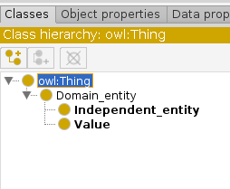

# Définition du top level

Dans cette section, on va simplement créer notre ontologie en la nommant, et créer son "top level" : il s'agit d'une bonne pratique qui permet d'organiser son travail correctement.

## Créer son ontologie

1. Lancez Protégé ;
2. Si une fenêtre pop-up apparaît, fermez la \(rappel : vous devez avoir installé [Matrix Views](tuto.md#plugin-and-configuration)\) ;
3. Rendez vous dans l'onglet `Active Ontology` de votre zone de travail \(à gauche de `Entities`\) ;
4. Renommez votre ontologie dans le champ `Ontology IRI` ;
5. Sauvegarder votre ontologie \(soit en format `Turtle` soit en format `RDF/XML`\).


Il est préférable de conserver le "préfixe" `http://www.semanticweb.org/YOURNAME/ontologies/` et y adjoindre le nom de votre ontologie. Tous vos noms seront associés à cette IRI, par exemple `http://www.semanticweb.org/YOURNAME/ontologies/PIZZA/Thick_crust`.

L'intérêt de ça est que, si vous avez un endpoint et/ou un entrepôt pour stocker votre ontologie, quand vous déréférencerez votre IRI, vous obtiendrez exactement l'élément ciblé \(par exemple la pâte épaisse\).


## Définir la hiérarchie haute par défault

1. Cliquez sur l'onglet `Entité` puis allez dans `Classes` \(couleur des fenêtres : jaune\) ;
2. Sélectionnez l'entité `owl:Thing` \(avec un clique gauche ; le volet de droite doit se mettre à jour\);
3. Aller ensuite de le menu `Tool` tout en haut, et cliquez sur `Create class hierarchy...`
4. Remplissez le text field avec le contenu suivant \(attention aux indentations !\)

   ```text
   Domain_entity
    Independent_entity
    Value
   ```

Vous devez avoir une structure comme cela à la suite de l'opération




`owl:Thing` subsume **toutes** vos entités ; autrement dit, n'importe quoi est quelque chose !


## Qu'est-ce qu'on vient de faire ?

On a créé une première structure qui va nous permettre de séparer les éléments indépendant \(_e.g._ la pâte, la garniture\), des éléments qui représentent une valeur d'un "même concept", comme par exemple le niveau d'épice de la pizza \(_e.g._ moyen, fort...\).

Il s'agit d'une bonne pratique, pour ne pas mélanger ces deux aspects dans une ontologie !

