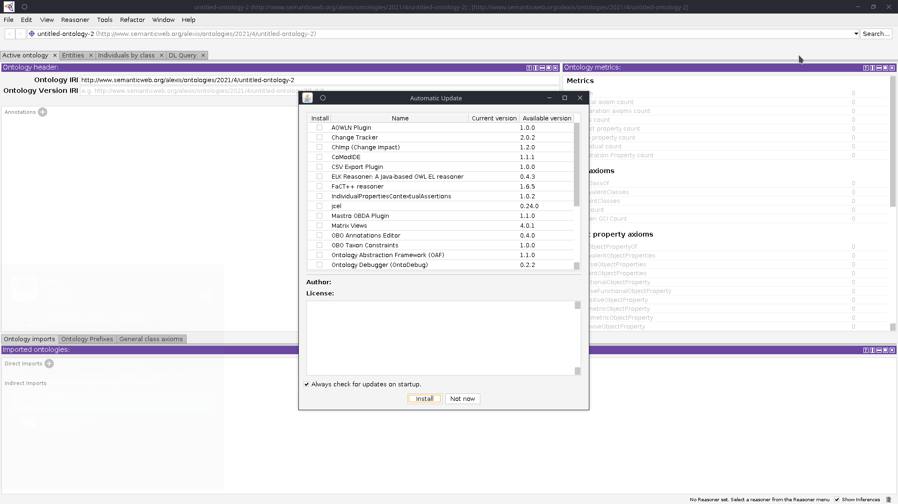

# Tutoriel

Ça y est ! Vous allez pouvoir respirer ! Fini le théorique, on rentre dans la pratique au travers un tutoriel pour faire votre première ontologie ! Les objectifs de cette section sont les suivants :

1. Vous apprendre à utiliser un WYSIWYG dédié à la création d'ontologie ;
2. Créer vos premières entités ;
3. Créer vos premières relations ; 
4. Comprendre les implications des relations entre les éléments ;
5. Effectuer vos premières inférences ;
6. Vous permettre de vous projeter dans vos contextes pro.

Ce tutoriel est fortement inspiré de celui proposé sur le [wiki de Protégé](https://protegewiki.stanford.edu/wiki/Protege4Pizzas10Minutes).

L'idée est de créer une ontologie concernant des pizzas.

## Sommaire

1. [Étude du problème](step1.md)
2. [Définition du top level](step2.md)
3. [Définition du squelette de la hiérarchie]()
4. [Définition des propriétés des objets]()
5. [Mise en relation des classes]()
6. [Finalisation de l'ontologie]()
7. [Classification et vérification]()

## Installation

Pour réaliser cette partie, nous utiliserons le logiciel [Protégé](https://protege.stanford.edu/) conçu pour l'élaboration d'ontologie. Rendez-vous dans la section téléchargement et sélectionnez la version qui correspond à votre système d'exploitation... ou [cliquez ici](https://protege.stanford.edu/products.php#desktop-protege).


Au moment du téléchargement, un pop-up vous demande de vous enregistrez ; si vous ne le souhaitez pas, vous n'avez simplement qu'à cliquer sur "Je suis déjà enregistré".


Une fois installé, vous devriez voir quelque chose de similaire.

## Plugin & configuration

1. Lorsque Protégé est démarré, rendez-vous dans `Fichier > Check Plugins` puis, sélectionnez `Matrix View`. Il s'agit d'un plugin qui va permettre de modifier plus rapidement les différents éléments.
2. Redémarrez ensuite Protégé
3. Dans `Window` \(ou `Fenêtre`\), sélectionnez `Tab > Class Matrix`
4. Dans `Window` \(ou `Fenêtre`\), sélectionnez `Tab > Property Matrix`

Vous voila paré !

